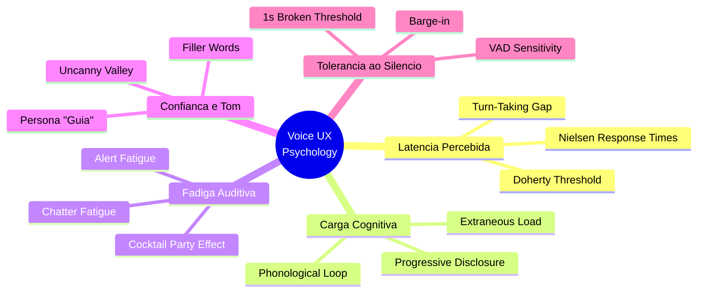
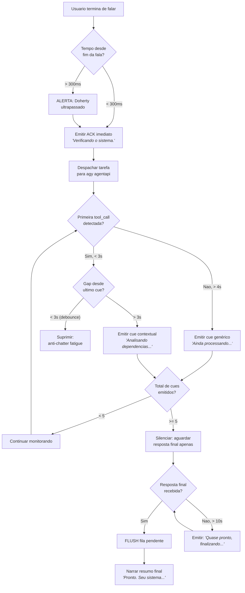

# Configuracao Psicologica do Voice UX: Nexo Daemon (Enterprise)

> Parametros empiricos derivados de psicologia cognitiva, analise conversacional,
> e pesquisa de HCI aplicados a um assistente de voz empresarial com fila dinamica de audio.

---

## 1. Mapa de Conceitos Psicologicos Aplicados



---

## 2. Os 12 Principios Psicologicos e Seus Limiares

### 2.1. Doherty Threshold (Limiar de Doherty)

| Atributo | Valor |
| :--- | :--- |
| **Autor** | Walter J. Doherty & Ahrvind J. Thadani (IBM, 1982) |
| **Definicao** | O tempo de resposta do sistema deve ser <= 400 ms para manter o "flow" cognitivo do usuario |
| **Aplicacao** | Tempo maximo entre o fim da fala do usuario e o inicio da primeira emissao audivel do sistema |
| **Limiar** | **< 400 ms** |

> [!IMPORTANT]
> Este e o numero mais critico de toda a arquitetura. Abaixo de 400 ms, o usuario percebe o sistema como
> "instantaneo". Acima, o cerebro registra uma espera consciente e a produtividade cai exponencialmente.

**Configuracao no Nexo Daemon:**
```toml
[voice.latency]
ack_deadline_ms = 300          # ACK local deve ser emitido antes de 300ms
doherty_ceiling_ms = 400       # Teto absoluto para primeiro audio audivel
```

---

### 2.2. Nielsen Response Time Limits (Limites de Tempo de Resposta de Nielsen)

| Autor | Jakob Nielsen (1993, *Usability Engineering*) |
| :--- | :--- |
| **Definicao** | Tres limiares perceptuais fundamentais para interfaces humanas |

| Limiar | Percepcao do Usuario | Acao do Sistema |
| :--- | :--- | :--- |
| **0.1 s (100 ms)** | Resposta percebida como **instantanea**. Manipulacao direta. | Nenhum feedback adicional necessario. |
| **1.0 s** | Fluxo de pensamento **nao e interrompido**, mas usuario nota o atraso. | Feedback sutil (e.g., tom de confirmacao). |
| **10 s** | Atencao do usuario **se dispersa**. Deseja fazer outra coisa. | Feedback de progresso obrigatorio e continuo. |

**Configuracao no Nexo Daemon:**
```toml
[voice.nielsen_thresholds]
instant_ms = 100               # Abaixo disso: nao precisa de feedback
flow_limit_ms = 1000           # Acima disso: precisa de cue de confirmacao
attention_limit_ms = 10000     # Acima disso: precisa de narração de progresso contínua
```

---

### 2.3. Conversational Turn-Taking Gap (Lacuna de Troca de Turno)

| Atributo | Valor |
| :--- | :--- |
| **Autores** | Harvey Sacks, Emanuel Schegloff, Gail Jefferson (1974) |
| **Definicao** | Em conversacao humana natural, a lacuna media entre turnos e de **200-300 ms** |
| **Paradoxo** | Producao de fala humana leva > 600 ms; humanos "antecipam" o fim do turno do interlocutor |
| **Aplicacao** | O assistente deve iniciar resposta audivel em **< 300 ms** para parecer "conversacional" |

> [!NOTE]
> Humanos nao esperam o interlocutor terminar para planejar a resposta. Eles *projetam* o fim do turno
> usando pistas prosodicas (entonacao descendente, desaceleracao). O Nexo Daemon deve replicar isso
> disparando o ACK *antes* de ter a resposta da LLM pronta.

**Configuracao no Nexo Daemon:**
```toml
[voice.turn_taking]
target_gap_ms = 250            # Meta: lacuna entre fim da fala do usuario e inicio do ACK
max_acceptable_gap_ms = 500    # Limite antes de ser percebido como "lento"
```

---

### 2.4. Silence Tolerance Threshold (Limiar de Tolerancia ao Silencio)

| Atributo | Valor |
| :--- | :--- |
| **Base Empirica** | Em conversas telefonicas, gaps > 1 s ocorrem < 5% do tempo |
| **Definicao** | Silencio > **1 segundo** faz o usuario pensar que o sistema travou |
| **Definicao Critica** | Silencio > **3 segundos** em assistente de voz = usuario repete comando ou abandona |

| Duracao do Silencio | Percepcao do Usuario | Estado Emocional |
| :--- | :--- | :--- |
| **0 - 0.5 s** | Natural, conversacional | Neutro / engajado |
| **0.5 - 1.0 s** | Nota o atraso, mas tolera | Ligeira impaciencia |
| **1.0 - 2.0 s** | Suspeita de falha, cogita repetir | Frustacao leve |
| **2.0 - 4.0 s** | Convicto de que o sistema travou | Frustacao moderada |
| **> 5.0 s** | Abandona a interacao ou fala por cima | Irritacao / desistencia |

> [!CAUTION]
> Silencio continuo acima de **2 segundos** sem qualquer feedback audivel e o fator #1 de
> abandono em assistentes de voz empresariais. Nunca permita isso.

**Configuracao no Nexo Daemon:**
```toml
[voice.silence]
max_dead_silence_ms = 1500     # Silencio maximo permitido antes de emitir cue de progresso
emergency_filler_ms = 2000     # Se nada na fila, emite filler genérico ("Processando...")
abandon_risk_ms = 4000         # Alerta interno: risco critico de abandono pelo usuario
```

---

### 2.5. Cognitive Load Theory (Teoria da Carga Cognitiva)

| Atributo | Valor |
| :--- | :--- |
| **Autor** | John Sweller (1988) + Alan Baddeley (Working Memory Model, 1974) |
| **Conceito Central** | A memoria de trabalho (phonological loop) tem capacidade **limitada** (~4 chunks) e decaimento rapido (~1-2 s) |

**Implicacoes para o Voice UX:**
- **Frases curtas:** Cada cue de audio deve ter no maximo **7-12 palavras** (1 chunk semantico).
- **Nao empilhar informacoes:** Se a fila acumular 3+ cues de progresso, descartar intermediarios e falar apenas o mais recente + o resumo final.
- **Redundancy Effect:** Nunca ler em voz alta o que ja esta na tela. Voz e tela devem complementar, nao duplicar.

| Tipo de Carga | Definicao | Meta no Nexo |
| :--- | :--- | :--- |
| **Intrinseca** | Complexidade inerente da tarefa | Decompor em sub-passos narrando 1 por vez |
| **Extrinseca** | Ruido cognitivo por design ruim | Eliminar: frases claras, sem jargao, sem repeticao |
| **Germane** | Esforco produtivo para formar esquemas mentais | Facilitar: narrar *o que* esta fazendo e *por que* |

**Configuracao no Nexo Daemon:**
```toml
[voice.cognitive_load]
max_cue_words = 12             # Maximo de palavras por frase de progresso
max_queued_cues = 3            # Acima disso: flush intermediarios, manter apenas ultimo + final
phonological_decay_ms = 2000   # Tempo de decaimento do loop fonologico
```

---

### 2.6. Alert Fatigue / Chatter Fatigue (Fadiga de Alertas)

| Atributo | Valor |
| :--- | :--- |
| **Definicao** | Excesso de notificacoes audíveis gera exaustao e habituacao (usuario ignora tudo) |
| **Dado Critico** | Apos interrupcao, leva **> 20 minutos** para recuperar foco profundo (Mark et al., UC Irvine) |
| **Risco** | Um assistente que fala a cada tool call individual torna-se insuportavel em < 3 minutos |

> [!WARNING]
> "Silencio zero" nao e a meta. A meta e **silencio controlado**: gaps de 2-4 segundos entre frases
> sao naturais e confortaveis. O que nao pode haver e silencio **incerto** acima de 5 segundos.

**Configuracao no Nexo Daemon:**
```toml
[voice.anti_fatigue]
min_gap_between_cues_ms = 3000  # Intervalo minimo entre frases de progresso (debounce)
max_cues_per_task = 5           # No maximo 5 frases intermediárias por tarefa
cooldown_after_burst_ms = 5000  # Se 3 cues foram emitidos em < 5s, silenciar por 5s
```

---

### 2.7. Filler Words & Discourse Markers (Marcadores Discursivos)

| Atributo | Valor |
| :--- | :--- |
| **Contexto Task-Oriented** | Fillers ("hmm", "deixa eu ver") fazem o assistente parecer **menos inteligente e menos confiável** |
| **Contexto Social** | Fillers aumentam percepcao de humanidade, mas reduzem percepcao de competencia |
| **Uso Estrategico** | Fillers "pensivos" ("Verificando o sistema...") sao melhores que silencio, mas nao devem simular hesitacao |

> [!TIP]
> Para contexto **empresarial**, nunca use fillers coloquiais ("hmm", "ah", "tipo...").
> Use **marcadores de acao objetivos**: "Consultando o banco de dados.", "Validando as credenciais.",
> "Compilando o relatorio." Eles comunicam progresso sem sacrificar credibilidade profissional.

**Configuracao no Nexo Daemon:**
```toml
[voice.discourse_markers]
style = "action_objective"     # "action_objective" | "conversational" | "minimal"
# action_objective: "Consultando o sistema...", "Validando dependências..."
# conversational:  "Deixa eu ver...", "Um momento..."
# minimal:         Tom de confirmação (beep) sem palavras

avoid_patterns = [
    "hmm", "uh", "tipo", "deixa eu pensar",
    "vou tentar", "talvez", "acho que"
]
```

---

### 2.8. Uncanny Valley (Vale da Estranheza Vocal)

| Atributo | Valor |
| :--- | :--- |
| **Autor** | Masahiro Mori (1970), aplicado a sintese de voz |
| **Definicao** | Vozes sinteticas *quase* humanas mas com falhas sutis geram desconforto e desconfianca |
| **Recomendacao Enterprise** | Voz clara, neutra, profissional. Nao tentar "imitar" humano perfeito. |

> [!IMPORTANT]
> Em ambiente empresarial, confianca e construida por **competencia e transparencia**, nao por
> humanidade vocal. Uma voz sintetica de alta qualidade que se identifica como assistente digital
> e mais confiavel que uma voz tentando enganar o usuario se passando por humano.

**Configuracao no Nexo Daemon:**
```toml
[voice.persona]
name = "Nexo"                  # Identificacao explicita como assistente
transparency = true            # Nunca fingir ser humano
voice_quality = "neural2"      # Alta qualidade, mas explicitamente sintetica
personality = "guide"          # Persona "Guia": competente, direto, prestativo
```

---

### 2.9. Cocktail Party Effect (Efeito de Festa)

| Atributo | Valor |
| :--- | :--- |
| **Autor** | Colin Cherry (1953) |
| **Definicao** | Humanos conseguem focar em 1 fonte sonora e filtrar outras, mas isso consome recursos cognitivos |
| **Aplicacao** | Cada notificacao do assistente compete com o ambiente. Menos = melhor. |

**Implicacao:** Em ambiente de escritorio empresarial, o assistente deve usar **assinatura sonora distinta** (pitch, timbre consistente) para que o usuario o identifique instantaneamente sem precisar "processar" quem esta falando.

**Configuracao no Nexo Daemon:**
```toml
[voice.audio_signature]
confirmation_tone_hz = 440     # Tom de confirmação (La4) breve antes de cada frase
use_consistent_voice = true    # Sempre a mesma voz, mesmo timbre, mesma velocidade
speaking_rate = 1.1            # Ligeiramente acima do normal (eficiencia sem pressa)
```

---

### 2.10. Progressive Disclosure (Revelacao Progressiva)

| Atributo | Valor |
| :--- | :--- |
| **Principio** | Revelar informacao apenas quando relevante ao contexto atual |
| **Voice-First** | Informacao audível e efemera (nao pode ser "re-lida"). Cada frase deve ser auto-contida. |

**Mapeamento para o Nexo Daemon:**

| Fase da Tarefa | O que Falar | O que Omitir |
| :--- | :--- | :--- |
| Inicio | "Estou verificando o sistema." | Detalhes tecnicos do pipeline |
| Meio (se > 4s) | "Analisando as dependencias do projeto." | Nomes de arquivos individuais |
| Fim | "Tudo pronto. Seu sistema tem X memoria e Y processador." | Logs internos, stack traces |
| Erro | "Encontrei um problema na conexao. Posso tentar novamente?" | Tracebacks, codigos HTTP |

---

### 2.11. Barge-in (Interrupcao pelo Usuario)

| Atributo | Valor |
| :--- | :--- |
| **Definicao** | O usuario fala enquanto o assistente ainda esta falando |
| **Expectativa Humana** | Em conversas, interrupcoes sao normais e esperadas |
| **Acao Obrigatoria** | Cortar audio imediatamente, limpar a fila, escutar nova entrada |

**Configuracao no Nexo Daemon:**
```toml
[voice.barge_in]
enabled = true                 # Habilitar deteccao de barge-in
vad_sensitivity = 0.6          # Sensibilidade do Voice Activity Detection (0-1)
flush_queue_on_barge = true    # Limpar toda a fila de audio pendente
cancel_running_tts = true      # Cancelar sintese em andamento
min_speech_duration_ms = 300   # Ignorar sons < 300ms (evitar falsos positivos)
```

---

### 2.12. Google HEART Framework (Metricas de Qualidade)

| Dimensao | Metrica para o Nexo | Como Medir |
| :--- | :--- | :--- |
| **Happiness** | Satisfacao com naturalidade | CSAT pos-interacao (1-5 estrelas) |
| **Engagement** | Frequencia de uso voluntario | Comandos de voz por dia por usuario |
| **Adoption** | Novos usuarios ativos | % de funcionarios usando voz vs. teclado |
| **Retention** | Retencao semanal | % de usuarios que voltam na semana seguinte |
| **Task Success** | Taxa de conclusao | % de tarefas completadas sem repeticao de comando |

---

## 3. Configuracao Consolidada Final (Enterprise)

Abaixo esta o bloco de configuracao unificado derivado dos 12 principios acima.
Este e o **perfil ideal** para um assistente de voz empresarial com fila dinamica de audio:

```toml
# ====================================================================
# nexo-daemon: voice_ux_profile.toml
# Perfil Enterprise derivado de 12 principios de psicologia cognitiva
# ====================================================================

[profile]
name = "enterprise-guide"
description = "Perfil profissional para assistente de voz empresarial"

# --- 1. Latencia (Doherty + Nielsen + Turn-Taking) ---
[latency]
ack_deadline_ms = 300          # ACK audível antes de 300ms (meta conversacional)
doherty_ceiling_ms = 400       # Teto absoluto Doherty Threshold
nielsen_flow_ms = 1000         # Acima disso: precisa feedback
nielsen_attention_ms = 10000   # Acima disso: precisa narração contínua
target_turn_gap_ms = 250       # Meta de gap entre turnos (Sacks/Schegloff)

# --- 2. Silencio (Tolerancia + Prevenção) ---
[silence]
max_dead_ms = 1500             # Silêncio máximo antes de emitir cue
emergency_filler_ms = 2000     # Se nada na fila: emitir filler de ação
abandon_risk_ms = 4000         # Alerta: risco de abandono pelo usuário
user_expectation = "task_dependent"
# Simples (timer, luz) = tolerância 0.5s
# Complexo (relatório) = tolerância 3-4s

# --- 3. Fila Dinamica de Audio (Cognitive Load + Anti-Fatigue) ---
[queue]
max_cue_words = 12             # Phonological loop: max 12 palavras/frase
max_queued_cues = 3            # Flush intermediários se > 3 pendentes
min_gap_between_cues_ms = 3000 # Debounce: mínimo 3s entre frases (anti-chatter)
max_cues_per_task = 5          # Máximo 5 intervenções por tarefa completa
cooldown_after_burst_ms = 5000 # Se 3 cues em < 5s: silenciar 5s
flush_on_final_response = true # Ao receber resposta final: descartar cues pendentes

# --- 4. Discurso e Tom (Enterprise Persona) ---
[persona]
name = "Nexo"
style = "guide"                # Competente, direto, prestativo
transparency = true            # Nunca fingir ser humano
voice_model = "pt-BR-Neural2-A"
speaking_rate = 1.1            # 10% acima da velocidade normal

[discourse]
marker_style = "action_objective"
# Exemplos: "Consultando o sistema.", "Validando as dependências."
avoid_patterns = [
    "hmm", "uh", "tipo", "deixa eu pensar",
    "vou tentar", "talvez", "acho que",
    "desculpa", "ops"
]
confirmation_tone = true       # Tom breve (440Hz, 80ms) antes da primeira frase

# --- 5. Barge-in (Interrupção) ---
[barge_in]
enabled = true
vad_sensitivity = 0.6
flush_queue = true
cancel_tts = true
min_speech_ms = 300            # Ignora sons < 300ms (evitar falso positivo)

# --- 6. Progressive Disclosure ---
[disclosure]
start_with_summary = true      # Primeiro: ação resumida ("Verificando...")
details_on_demand = true       # Detalhes só se o usuário perguntar
omit_internal_logs = true      # Nunca narrar stack traces ou códigos HTTP
error_style = "offer_retry"    # "Encontrei um problema. Posso tentar novamente?"
```

---

## 4. Fluxo de Decisao da Fila Dinamica (Psicologicamente Otimizado)



---

## 5. Tabela de Referencia Rapida: Timing Ideal

| Evento | Tempo Meta | Principio Psicologico | Risco se Excedido |
| :--- | :--- | :--- | :--- |
| Fim da fala do usuario → ACK audível | **< 300 ms** | Turn-Taking (Sacks/Schegloff) | Parece "lento", perde naturalidade |
| Fim da fala → Primeiro conteúdo útil | **< 400 ms** | Doherty Threshold | Quebra do flow cognitivo |
| Silêncio contínuo máximo | **< 1.5 s** | Silence Tolerance | Usuario pensa que travou |
| Gap entre frases de progresso | **3-5 s** | Anti-Chatter Fatigue | Irritação por excesso de fala |
| Máximo de cues por tarefa | **5 frases** | Cognitive Load (Sweller) | Sobrecarga do phonological loop |
| Palavras por frase de cue | **7-12** | Working Memory (Baddeley) | Informação perdida antes de processar |
| Resposta final pos-flush | **< 500 ms** | Nielsen 1.0s limit | Atraso injustificável (dados já prontos) |
| Detecção de barge-in | **< 300 ms** | Conversational Norms | Falar por cima do usuário = rude |

---

## 6. Anti-Padroes a Evitar

| Anti-Padrao | Principio Violado | Consequencia |
| :--- | :--- | :--- |
| "Silencio zero" (falar ininterruptamente) | Chatter Fatigue + Cognitive Load | Usuario desliga em < 3 minutos |
| Fillers coloquiais ("hmm", "tipo") | Enterprise Trust + Competence Bias | Assistente parece incompetente |
| Narrar cada tool call individual | Alert Fatigue (Mark et al.) | 20 min para recuperar foco |
| Voz tentando parecer humana demais | Uncanny Valley (Mori) | Desconforto, desconfianca |
| Fila acumulada de 10+ cues defasados | Progressive Disclosure | Resposta final atrasa 30+ segundos |
| Silencio de 5+ segundos sem feedback | Silence Tolerance + Learned Helplessness | Abandono ou repeticao de comando |
| Ler em voz alta o que esta na tela | Redundancy Effect (Sweller) | Sobrecarga sem valor |

---

## 7. Fontes Academicas

| # | Referencia | Contribuicao |
| :--- | :--- | :--- |
| 1 | Doherty, W. J. & Thadani, A. J. (1982). IBM Systems Journal. | Limiar de 400ms para produtividade |
| 2 | Nielsen, J. (1993). *Usability Engineering*. Academic Press. | 0.1s / 1.0s / 10s response time limits |
| 3 | Sacks, H., Schegloff, E. A., Jefferson, G. (1974). Language, 50(4). | Turn-taking em conversacao: gap 200-300ms |
| 4 | Sweller, J. (1988). Cognitive Science, 12(2). | Cognitive Load Theory |
| 5 | Baddeley, A. D. & Hitch, G. J. (1974). Working Memory. | Phonological loop, ~4 chunks, decaimento 1-2s |
| 6 | Cherry, E. C. (1953). JASA, 25(5). | Cocktail Party Effect |
| 7 | Mori, M. (1970). Energy, 7(4). | Uncanny Valley |
| 8 | Mark, G. et al. (UC Irvine). | > 20 min para recuperar foco apos interrupcao |
| 9 | Google HEART Framework. Kerry Rodden et al. (2010). | Happiness, Engagement, Adoption, Retention, Task Success |
